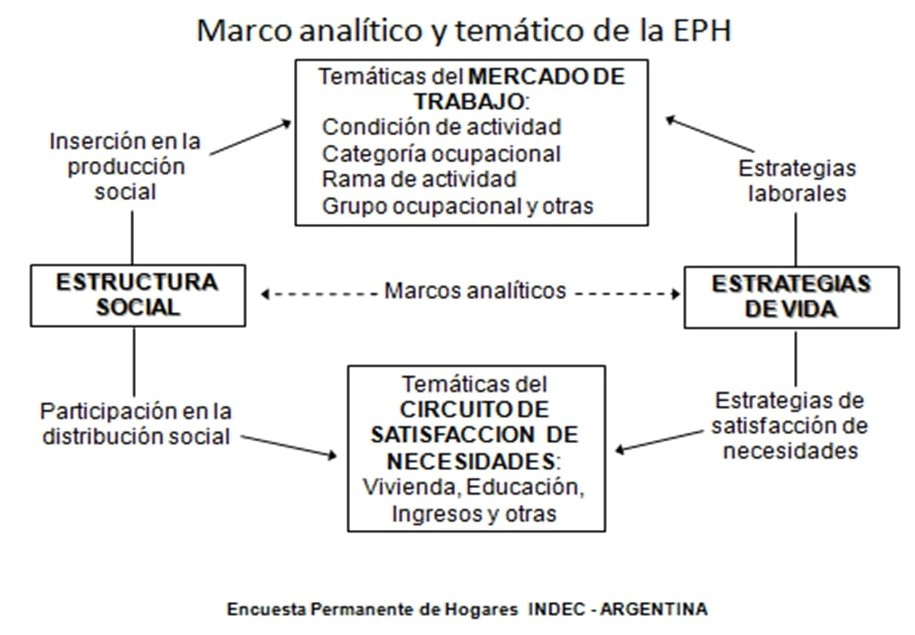
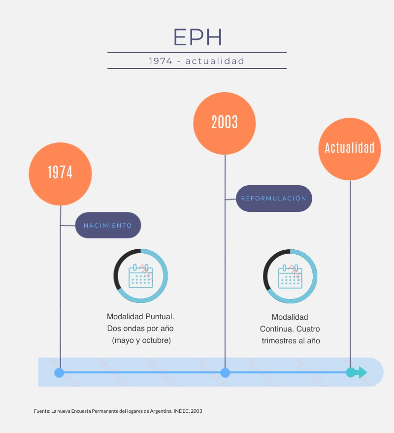
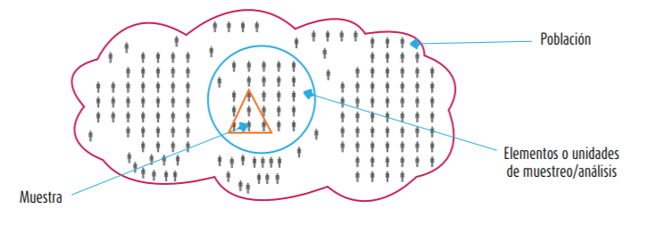

# Bienvenidos y bienvenidas a Estación R

## Contacto con Estación R

  

::: columns
::: {.column width="33%"}
#### 💬 [Slack](https://estacion-r.slack.com/)

#### 🔗 [Web](https://estacion-r.com)

#### ✉️ [Correo](mailto:pablotiscornia@estacion-r.com)
:::

::: {.column width="33%"}
#### 🐘 [Mastodon](https://botsin.space/@r_tips)

#### 𝕏 [X](https://twitter.com/estacion_erre)
:::

::: {.column width="33%"}
#### [in] [LinkedIn](https://www.linkedin.com/company/estacion-r/)

#### [ig] [Instagram](https://instagram.com/estacion_ere)
:::
:::

# El curso 📚 {background-color="#4F7CFF"}

## Programa del curso

 

| Módulo | Tema                                       |
|--------|--------------------------------------------|
| **1**  | Introducción al curso y a la EPH           |
| **2**  | Introducción a R + IA en análisis de datos |
| **3**  | tidyverse I: Importación y selección       |
| **4**  | tidyverse II: Transformación y resumen     |
| **5**  | Proyectos y organización de trabajo        |
| **6**  | Visualización con ggplot2 + TP integrador  |

## Dinámica de trabajo

 

::: {.fragment .fade-in-then-semi-out}
### 📅 6 encuentros de 2:30 hs cada uno (martes 19hs ARG)
:::

 

::: {.fragment .fade-in-then-semi-out}
### 📝 Ejercitación semanal (no obligatoria)
:::

 

::: {.fragment .fade-in-then-semi-out}
### 🎯 Trabajo práctico integrador al final
:::

 

::: {.fragment .fade-in-then-semi-out}
### 🎥 Grabación de todos los encuentros
:::

 

::: {.fragment}
### 💬 Comunicación por **Slack**
:::

## Página de Estación R {background-color="#D4FF4F"}

  

::: {style="text-align: center; font-size: 1.5em;"}
### 🔗 [estacion-r.github.io/intro-r-sociales](https://estacion-r.github.io/intro-r-sociales/)
:::

  

::: {.fragment}
::: {style="text-align: center;"}
*Vamos a recorrer la página juntos...*
:::
:::

## Presentémonos 🙋

Contanos en el chat o en voz:

 

::: {.fragment .fade-in-then-semi-out}
- 👤 Tu **nombre**
:::

::: {.fragment .fade-in-then-semi-out}
- 🌍 De dónde **sos**
:::

::: {.fragment .fade-in-then-semi-out}
- 💼 ¿Qué **hacés**? (trabajo, estudio)
:::

::: {.fragment .fade-in-then-semi-out}
- 🤔 ¿Por qué te **interesa R**?
:::

::: {.fragment}
- 💻 ¿Tenés **experiencia previa** con R u otro lenguaje?
:::

# ¿Qué es la EPH? 📋 {background-color="#4F7CFF"}

------------------------------------------------------------------------

{fig-align="center" width="60%"}

------------------------------------------------------------------------

## Marco analítico conceptual

{fig-align="center" width="80%"}

# Fuentes de datos {background-color="#F5F5F5"}

## Tipos de fuentes

 

::: {.fragment .fade-in-then-semi-out}
### 📊 Censos

*Le pregunto a TODA la población sobre sus características*
:::

 

::: {.fragment .fade-in-then-semi-out}
### 📁 Registros administrativos

*La población está registrada en formularios (con fines estadísticos o no)*
:::

 

::: {.fragment .fade-in-then-semi-out}
### 📝 Encuestas

*No puedo acceder a toda la población, le pregunto sólo a una porción*
:::

 

::: {.fragment}
### 📱 Dispositivos interconectados

*La población "deja" rastros en celulares, internet, operaciones digitales*
:::

# Objetivos de la EPH {background-color="#4F7CFF"}

## Objetivo general

 

El **objetivo general** de la encuesta es el análisis de la **inserción de la población en la estructura económico-social**.

 

::: {.fragment}
Dicha inserción puede ser analizada a partir de tres ejes:
:::

 

::: {.fragment .fade-in-then-semi-out}
1. Características **demográficas**
:::

::: {.fragment .fade-in-then-semi-out}
2. Inserción en la **producción** de bienes y servicios
:::

::: {.fragment}
3. Participación en la **distribución** del producto social
:::

# Características de la EPH {background-color="#F5F5F5"}

## Historia de la EPH

{fig-align="center" width="50%"}

## Cobertura geográfica

 

::: {.fragment .fade-in-then-semi-out}
- **Dominio de estimación:** Principales aglomerados urbanos
:::

 

::: {.fragment .fade-in-then-semi-out}
- Fue creciendo progresivamente hasta llegar a **31 aglomerados urbanos**:
    - Todas las capitales de provincia
    - Aglomerados con +100.000 habitantes
:::

 

::: {.fragment}
- **Concepto de aglomerado:** *"Dos localidades distintas pero próximas que conforman un único mercado de trabajo"*
:::

## ¿A quiénes representa?

 

::: {.fragment .fade-in-then-semi-out}
- La encuesta representa al **65%** del total de la población argentina
:::

 

::: {.fragment .fade-in-then-semi-out}
- Una vez al año se releva la **EAHU** (extensión al 100% de población urbana)
:::

 

::: {.fragment}
- Proyecto en pruebas: cobertura del ámbito rural
:::

# La Muestra 🎯 {background-color="#4F7CFF"}

## ¿Qué es una muestra?

 

La EPH es una **encuesta por muestreo**: se selecciona un grupo de hogares que representan al conjunto del universo.

 

{fig-align="center" width="70%"}

::: aside
Fuente: Hernández-Sampieri, "Metodología de la Investigación"
:::

## Tamaño de la muestra

 

Por cada trimestre se relevan aproximadamente:

 

::: {.fragment .fade-in-then-semi-out}
- **~18.000 hogares** (representan a más de 9 millones)
:::

 

::: {.fragment}
- **~58.000 personas** (representan a más de 27 millones)
:::

## Diseño muestral

 

**Diseño bietápico estratificado:**

 

::: {.fragment .fade-in-then-semi-out}
1. **Primera etapa:** Se seleccionan **radios censales** (áreas) dentro de cada aglomerado
:::

 

::: {.fragment .fade-in-then-semi-out}
2. **Segunda etapa:** Se listan las **viviendas** del área y se seleccionan aleatoriamente
:::

 

::: {.fragment}
**Esquema de rotación:** 2-2-2

*(Un hogar está en muestra 2 trimestres, sale 2 trimestres, y vuelve 2 trimestres)*
:::

# Principales temáticas 📊 {background-color="#F5F5F5"}

## ¿Qué mide la EPH?

 

::: columns
::: {.column width="50%"}
::: {.fragment .fade-in-then-semi-out}
- Características **demográficas** básicas
:::

::: {.fragment .fade-in-then-semi-out}
- Características **ocupacionales** (empleo, desempleo, informalidad)
:::

::: {.fragment .fade-in-then-semi-out}
- Características **migratorias**
:::
:::

::: {.column width="50%"}
::: {.fragment .fade-in-then-semi-out}
- Características **habitacionales**
:::

::: {.fragment .fade-in-then-semi-out}
- Características **educacionales**
:::

::: {.fragment}
- Características de **ingreso**
:::
:::
:::

# Tres cuestionarios 📝 {background-color="#4F7CFF"}

## Cuestionario de Vivienda 🏠

 

**Definición:** *"Cualquier recinto fijo o móvil construido o adaptado para alojar personas"*

 

::: {.fragment}
Principales dimensiones:

- Identificación de viviendas y hogares
- Características de la vivienda y hábitat
- Condición de residencia
:::

## Cuestionario de Hogar 👨‍👩‍👧‍👦

 

**Definición:** *"Persona o grupo de personas, parientes o no, que viven bajo un mismo techo y comparten los gastos de alimentación"*

 

::: {.fragment .fade-in-then-semi-out}
### El jefe/a de hogar

*"Aquella persona reconocida como tal por los demás miembros del hogar"*
:::

 

::: {.fragment}
Criterios de asignación (en orden):

1. Responsabilidad económica del hogar
2. Miembro más antiguo
3. Quien haya acudido al llamado
:::

## Cuestionario Individual 👤

 

::: {.fragment .fade-in-then-semi-out}
- **Aplicación:** Todas las personas residentes **mayores de 10 años**
:::

 

::: {.fragment}
- **Respondentes:** Mayores de 18 años (puede ser auto o no auto-respondente)
:::

# Indicadores clave 📈 {background-color="#F5F5F5"}

## Indicadores de bienestar

 

::: {.fragment .fade-in-then-semi-out}
- % de personas con **cobertura de salud** solo por sistema público
:::

 

::: {.fragment .fade-in-then-semi-out}
- % de hogares **sin agua de red** dentro de la vivienda
:::

 

::: {.fragment .fade-in-then-semi-out}
- % de hogares **sin acceso a red cloacal**
:::

 

::: {.fragment}
- % de población **asalariada informal** (sin descuento jubilatorio)
:::

## Indicadores de empleo

 

::: {.fragment .fade-in-then-semi-out}
- Tasa de **desocupación**
:::

 

::: {.fragment .fade-in-then-semi-out}
- % de ocupados que trabajan **más de 45 horas semanales**
:::

 

::: {.fragment .fade-in-then-semi-out}
- Tasa de participación en **trabajo doméstico no remunerado**
:::

 

::: {.fragment}
- % de población en edad de jubilarse que **cobra jubilación/pensión**
:::

# Clasificadores 🏷️ {background-color="#4F7CFF"}

## Clasificadores utilizados

 

::: {.fragment .fade-in-then-semi-out}
- **Actividad (rama):** [CAES-MERCOSUR](https://www.indec.gob.ar/ftp/cuadros/menusuperior/clasificadores/notas_explicativas_caes_v2018.pdf)
:::

 

::: {.fragment .fade-in-then-semi-out}
- **Ocupación:** [CNO-2001-INDEC](https://www.indec.gob.ar/ftp/cuadros/menusuperior/clasificadores/definiciones_conceptuales_cno.pdf)
:::

 

::: {.fragment}
- **Códigos geográficos:** [Países](https://www.indec.gob.ar/ftp/cuadros/menusuperior/eph/codigospaises_09.pdf) y [Provincias](https://www.indec.gob.ar/ftp/cuadros/menusuperior/eph/codigosprovincias_09.pdf)
:::

# Documentación 📖 {background-color="#F5F5F5"}

## Links útiles

 

::: columns
::: {.column width="50%"}
::: {.fragment .fade-in-then-semi-out}
### Cuestionarios
- [Cuestionario individual](https://www.indec.gob.ar/ftp/cuadros/sociedad/EPHContinua_CIndividual.pdf)
- [Cuestionario Hogar](https://www.indec.gob.ar/ftp/cuadros/sociedad/EPHContinua_CHogar.pdf)
- [Cuestionario Vivienda](https://www.indec.gob.ar/ftp/cuadros/sociedad/EPHContinua_CVivienda.pdf)
:::
:::

::: {.column width="50%"}
::: {.fragment}
### Metodología
- [Diseño de registro](https://www.indec.gob.ar/ftp/cuadros/menusuperior/eph/EPH_registro_1t19.pdf)
- [La nueva EPH continua](https://www.indec.gob.ar/ftp/cuadros/sociedad/metodologia_eph_continua.pdf)
:::
:::
:::

# Ejercicio para la semana 📝 {background-color="#D4FF4F"}

## Explorar la documentación

 

::: {.fragment .fade-in-then-semi-out}
### 1. Descargar alguno de los cuestionarios de la EPH
:::

 

::: {.fragment .fade-in-then-semi-out}
### 2. Identificar preguntas relacionadas con:
- Situación laboral
- Nivel educativo
- Ingresos
:::

 

::: {.fragment}
### 3. Pensar: ¿qué indicadores podrías construir con esas variables?
:::

# ¡Listo! {background-color="#4F7CFF"}

## Próximo encuentro

::: {style="text-align: center;"}

 

### 📅 Fecha: Martes 3 de febrero, 19hs (ARG)

 

### 📚 Tema: Introducción a R + IA en el análisis de datos

 

::: {.fragment}
### Seguimos la comunicación por **Slack**
:::

 

::: {.fragment}
### **¿Preguntas?** 🙋
:::
:::
