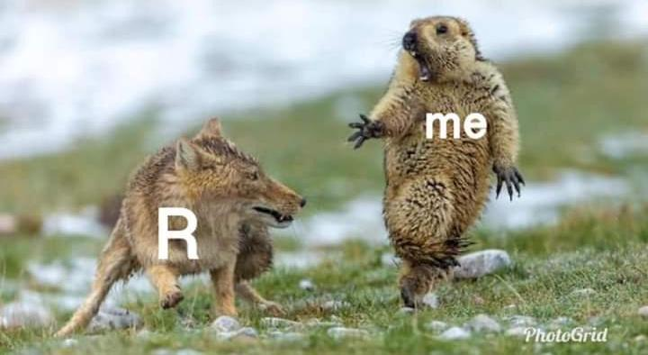
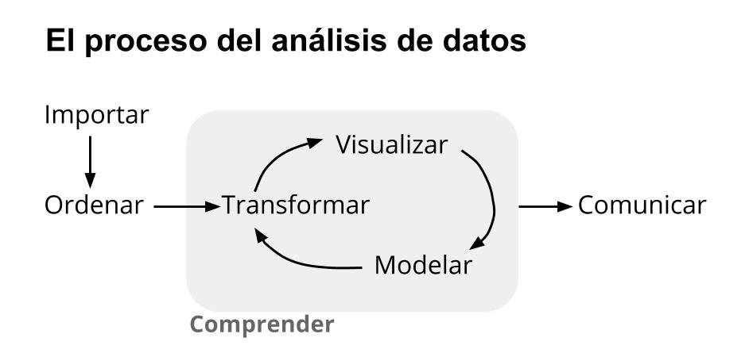

# Bienvenidos y bienvenidas {background-color="#4F7CFF"}

## Contacto con Estación R

<br><br>

::: columns
::: {.column width="33%"}
#### [Slack](https://estacion-r.slack.com/)

#### [Web](https://estacion-r.com)

#### [Correo](mailto:pablotiscornia@estacion-r.com)
:::

::: {.column width="33%"}
#### [Mastodon](https://botsin.space/@r_tips)

#### [X](https://twitter.com/estacion_erre)
:::

::: {.column width="33%"}
#### [LinkedIn](https://www.linkedin.com/company/estacion-r/)

#### [Instagram](https://instagram.com/estacion_ere)
:::
:::

## ¿Cómo les fue con la EPH?

<br>

::: {.fragment .fade-in-then-semi-out}
### Cuéntenme en el chat o en voz...
:::

<br>

::: {.fragment .fade-in-then-semi-out}
- ¿Pudieron explorar los cuestionarios?
:::

::: {.fragment .fade-in-then-semi-out}
- ¿Encontraron alguna variable interesante?
:::

::: {.fragment}
- ¿Surgieron dudas sobre la metodología?
:::

# Hoja de ruta de hoy {background-color="#F5F5F5"}

## Contenidos del encuentro

<br>

::: columns
::: {.column width="50%"}
::: {.fragment .fade-in-then-semi-out}
### Primera parte
- ¿Qué es R?
- ¿Qué es la Ciencia de Datos?
- R vs RStudio
- Conceptos básicos
:::
:::

::: {.column width="50%"}
::: {.fragment}
### Segunda parte
- Funciones y objetos
- Data frames
- **IA como asistente**
:::
:::
:::

# ¿Qué es R? {background-color="#4F7CFF"}

## Primera impresión

<br>

{fig-align="center" width="60%"}

## Evolución emocional

<br>

{fig-align="center" width="80%"}

## R es...

<br>

::: {.fragment .fade-in-then-semi-out}
### Un lenguaje de programación
Especializado en análisis y visualización de datos
:::

<br>

::: {.fragment .fade-in-then-semi-out}
### Código abierto
Se puede usar y modificar sin pagar licencias
:::

<br>

::: {.fragment .fade-in-then-semi-out}
### Impulsado por la comunidad
Academia, investigación, sector privado, gente de a pie
:::

<br>

::: {.fragment}
### Herramienta por excelencia
En universidades, empresas tech y periodismo de datos
:::

# ¿Qué es la Ciencia de Datos? {background-color="#F5F5F5"}

## El proceso de la Ciencia de Datos

<br>

{fig-align="center" width="80%"}

## El circuito del dato

<br>

{fig-align="center" width="90%"}

# R != RStudio {background-color="#4F7CFF"}

## R y RStudio son cosas diferentes

<br>

::: columns
::: {.column width="50%"}
### R (el motor)
{fig-align="center" width="90%"}
:::

::: {.column width="50%"}
### RStudio (el auto)
{fig-align="center" width="90%"}
:::
:::

## Las 4 ventanas de RStudio

<br>

::: {.fragment .fade-in-then-semi-out}
**1. Script** (arriba izquierda): donde escribimos código
:::

<br>

::: {.fragment .fade-in-then-semi-out}
**2. Consola** (abajo izquierda): donde se ejecuta el código
:::

<br>

::: {.fragment .fade-in-then-semi-out}
**3. Environment** (arriba derecha): objetos guardados en memoria
:::

<br>

::: {.fragment}
**4. Files/Plots/Help** (abajo derecha): archivos, gráficos, ayuda
:::

# ¡Vamos a RStudio! {background-color="#D4FF4F"}

## Puesta a punto

<br>

::: {.fragment .fade-in-then-semi-out}
### 1. Identificar las 4 ventanas principales
:::

<br>

::: {.fragment .fade-in-then-semi-out}
### 2. Cambiar la apariencia (tema oscuro/claro)
:::

<br>

::: {.fragment}
### 3. Configurar *Global Options* > General
- Desmarcar "Restore .RData into workspace at startup"
- Save workspace: **Never**
:::

# Conceptos básicos de R {background-color="#4F7CFF"}

## Valores

<br>

::: {.fragment .fade-in-then-semi-out}
### Numéricos
```{r}
100
```
:::

<br>

::: {.fragment .fade-in-then-semi-out}
### De texto (caracteres)
```{r}
"cien"
```
:::

<br>

::: {.fragment}
### ¿Y esto qué es?
```{r}
"100"
```
:::

## Vectores

Un vector es una colección de valores del mismo tipo.

<br>

::: {.fragment .fade-in-then-semi-out}
### Vector numérico
```{r}
c(100, 102, 200)
```
:::

<br>

::: {.fragment}
### Vector de texto
```{r}
c("cien", "ciento dos", "doscientos")
```
:::

## Observen este código

<br>

```{r}
c(1, 2, 3, 4, 5)
```

<br>

::: {.fragment}
```{r}
c("rojo", "verde", "azul")
```
:::

<br>

::: {.fragment}
### ¿Qué creen que hace `c()`?

*Miren los valores de entrada y el resultado...*
:::

## La función `c()`

<br>

La `c` viene de **concatenar** o **combinar**.

<br>

::: {.fragment .fade-in-then-semi-out}
### Es la forma de crear vectores en R
:::

<br>

::: {.fragment}
```{r}
c(10, 20, 30, 40, 50)
```
:::

# Funciones {background-color="#F5F5F5"}

## ¿Qué son las funciones?

<br>

::: {.fragment .fade-in-then-semi-out}
Las funciones son el **alma del lenguaje R**.
:::

<br>

::: {.fragment .fade-in-then-semi-out}
Reciben un **input** (entrada) y devuelven un **output** (salida).
:::

<br>

::: {.fragment}
Siempre se escriben así:

`nombre_de_la_funcion(input)`
:::

## Veamos una función en acción

<br>

```{r}
class(1)
```

<br>

::: {.fragment}
```{r}
class("hola")
```
:::

<br>

::: {.fragment}
### ¿Qué creen que hace `class()`?

*Cuéntenme en el chat o levanten la mano...*
:::

## La función `class()`

<br>

### Devuelve el **tipo** o **clase** del valor

<br>

::: {.fragment .fade-in-then-semi-out}
```{r}
class(100)
```
`numeric` = número
:::

<br>

::: {.fragment}
```{r}
class("100")
```
`character` = texto (por las comillas)
:::

## Otra función: observen el resultado

<br>

```{r}
length(c(10, 20, 30))
```

<br>

::: {.fragment}
```{r}
length(c("a", "b", "c", "d", "e"))
```
:::

<br>

::: {.fragment}
### ¿Qué creen que hace `length()`?
:::

## La función `length()`

<br>

### Devuelve la **longitud** (cantidad de elementos)

<br>

```{r}
mi_vector <- c(10, 20, 30, 40, 50)
length(mi_vector)
```

## Una más: ¿qué está pasando acá?

<br>

```{r}
mean(c(10, 20, 30))
```

<br>

::: {.fragment}
```{r}
mean(c(100, 200))
```
:::

<br>

::: {.fragment}
### ¿Qué hace `mean()`?

*Pista: pensá en los números...*
:::

## La función `mean()`

<br>

### Calcula el **promedio** (media aritmética)

<br>

```{r}
# (10 + 20 + 30) / 3 = 20
mean(c(10, 20, 30))
```

## ¿Qué pasa si...?

<br>

```{r}
#| error: true
mean(c("10", "20", "30"))
```

<br>

::: {.fragment}
### ¿Por qué falla?

*Mirá bien los valores...*
:::

<br>

::: {.fragment}
**¡Son texto!** (tienen comillas). No se puede calcular el promedio de texto.
:::

# Objetos {background-color="#4F7CFF"}

## Todo puede guardarse en un objeto

<br>

::: {.fragment .fade-in-then-semi-out}
Para guardar algo en un objeto usamos `<-`
:::

<br>

::: {.fragment}
```r
nombre_del_objeto <- algo
```
:::

## Ejemplos de objetos

<br>

### Guardar un número
```{r}
mi_numero <- 1
mi_numero
```

<br>

::: {.fragment}
### Guardar un vector
```{r}
mis_edades <- c(10, 20, 30)
mis_edades
```
:::

## Usar objetos como input

<br>

```{r}
edades <- c(20, 45, 23)
```

<br>

::: {.fragment}
```{r}
mean(edades)
```
:::

<br>

::: {.fragment}
```{r}
length(edades)
```
:::

# Descanso {background-color="#F5F5F5"}

## 10 minutos

<br><br>

::: {style="text-align: center; font-size: 3em;"}
☕
:::

# Data Frames {background-color="#4F7CFF"}

## ¿Qué es un Data Frame?

<br>

::: {.fragment .fade-in-then-semi-out}
Un **Data Frame** es una **tabla** de datos.
:::

<br>

::: {.fragment .fade-in-then-semi-out}
Es la combinación de varios **vectores** (columnas).
:::

<br>

::: {.fragment}
Cada vector tiene la misma cantidad de elementos (filas).
:::

## Crear un Data Frame

<br>

```{r}
vector_edad <- c(20, 43, 102, 56)
vector_nombre <- c("Pepe", "Pepa", "Rigoberto", "Rodoberta")

base_personas <- data.frame(vector_edad, vector_nombre)
```

<br>

::: {.fragment}
```{r}
base_personas
```
:::

## Observen este código

<br>

```{r}
base_personas$vector_nombre
```

<br>

::: {.fragment}
```{r}
base_personas$vector_edad
```
:::

<br>

::: {.fragment}
### ¿Qué creen que hace el símbolo `$`?

*Comparen con la tabla que creamos antes...*
:::

## El operador `$`

<br>

### Accede a una **columna** del data frame

<br>

```r
nombre_del_dataframe$nombre_de_columna
```

<br>

::: {.fragment}
El resultado es un **vector** (una sola columna).
:::

## Aplicar funciones a columnas

<br>

```{r}
class(base_personas$vector_nombre)
```

<br>

::: {.fragment}
```{r}
mean(base_personas$vector_edad)
```
:::

# Ejercitación {background-color="#D4FF4F"}

## A practicar

<br>

::: {.fragment .fade-in-then-semi-out}
### 1. Crear un objeto `edad_personas` con estos valores:
17, 92, 56, 32, 102
:::

<br>

::: {.fragment .fade-in-then-semi-out}
### 2. Chequear su tipo con `class()`
:::

<br>

::: {.fragment .fade-in-then-semi-out}
### 3. Conocer su longitud con `length()`
:::

<br>

::: {.fragment}
### 4. Calcular la edad promedio con `mean()`
:::

# IA como compañera de aprendizaje {background-color="#4F7CFF"}

## ¿Para qué usar IA en este curso?

<br>

::: {.fragment .fade-in-then-semi-out}
### NO para que escriba código por nosotros
:::

<br>

::: {.fragment .fade-in-then-semi-out}
### SÍ para que nos **acompañe** mientras aprendemos
:::

<br>

::: {.fragment}
### La idea: que nos guíe sin darnos la respuesta
*Como un tutor que hace preguntas en lugar de resolver todo*
:::

## IA como tutor

<br>

::: {.fragment .fade-in-then-semi-out}
### Nos ayuda a entender errores
Sin simplemente "arreglarlos"
:::

<br>

::: {.fragment .fade-in-then-semi-out}
### Nos explica conceptos
De formas diferentes hasta que comprendamos
:::

<br>

::: {.fragment}
### Nos da pistas, no soluciones
Para que el aprendizaje sea nuestro
:::

## Herramientas gratuitas

<br>

::: columns
::: {.column width="50%"}
::: {.fragment .fade-in-then-semi-out}
### ChatGPT
[chat.openai.com](https://chat.openai.com)

Versión gratuita disponible
:::
:::

::: {.column width="50%"}
::: {.fragment}
### Claude
[claude.ai](https://claude.ai)

Versión gratuita disponible
:::
:::
:::

## El arte de preguntar bien

<br>

::: {.fragment .fade-in-then-semi-out}
### Lo más importante:
Pedirle que **no te dé la solución directa**
:::

<br>

::: {.fragment}
### Ejemplo de prompt inicial:

> *"Estoy aprendiendo R. Cuando te haga preguntas sobre código, no me des la solución completa. Dame pistas, haceme preguntas para que piense, y guiame paso a paso."*
:::

## Prompt para resolver ejercicios

<br>

Cuando te trabás en un ejercicio:

<br>

::: {.fragment}
> *"Tengo que crear un vector con 5 edades y calcular el promedio. Escribí este código pero no funciona:*
>
> `edades <- (25, 30, 45)`
>
> *¿Qué estoy haciendo mal? No me des la solución, dame una pista."*
:::

## Prompt para entender errores

<br>

Cuando R te da un error:

<br>

::: {.fragment}
> *"R me da este error: `Error in mean(x) : argument "x" is missing`*
>
> *Estaba intentando calcular un promedio. ¿Qué significa este error? Explicamelo sin darme el código corregido."*
:::

## Prompt para explorar funciones

<br>

Cuando querés saber más sobre una función:

<br>

::: {.fragment}
> *"Aprendí que `class()` me dice el tipo de un valor. ¿Qué otras funciones similares existen para conocer características de mis datos? Dame ejemplos para probar."*
:::

## Ejercicio: configurar tu tutor IA {background-color="#D4FF4F"}

<br>

### Probemos ahora

<br>

::: {.fragment .fade-in-then-semi-out}
1. Abran ChatGPT o Claude
:::

<br>

::: {.fragment .fade-in-then-semi-out}
2. Copien este prompt inicial:

> *"Estoy aprendiendo R desde cero. Quiero que seas mi tutor. Cuando te pregunte algo, no me des la solución directa: haceme preguntas, dame pistas, y dejá que yo escriba el código."*
:::

<br>

::: {.fragment}
3. Luego pregunten: *"¿Cómo hago para saber cuántos elementos tiene un vector?"*
:::

## ¿Qué respuesta esperamos?

<br>

::: {.fragment .fade-in-then-semi-out}
### Una buena respuesta de la IA sería:

> *"¿Ya conocés alguna función que te dé información sobre vectores? Pensá en las que viste en clase... hay una que te dice la 'longitud' de algo. ¿Te suena?"*
:::

<br>

::: {.fragment}
### NO queremos:

> *"Usá la función `length()`. Ejemplo: `length(mi_vector)`"*
:::

## Importante

<br>

::: {.fragment .fade-in-then-semi-out}
### El código lo escribimos nosotros
La IA guía, nosotros ejecutamos
:::

<br>

::: {.fragment .fade-in-then-semi-out}
### Si la IA da la respuesta directa
Pedirle que reformule como pregunta
:::

<br>

::: {.fragment}
### El objetivo es APRENDER
No terminar rápido
:::

## Cuidados al usar IA

<br>

::: {.fragment .fade-in-then-semi-out}
### Tiene fecha de corte
Fue entrenada con datos hasta cierta fecha. No conoce lo más reciente.
:::

<br>

::: {.fragment .fade-in-then-semi-out}
### Puede "alucinar"
A veces inventa funciones, paquetes o datos que no existen.
:::

<br>

::: {.fragment}
### No siempre es precisa
Puede dar respuestas correctas "a medias" o con errores sutiles.
:::

## Más cuidados

<br>

::: {.fragment .fade-in-then-semi-out}
### Depende mucho del contexto
Si no le damos suficiente información, las respuestas pueden ser genéricas o incorrectas.
:::

<br>

::: {.fragment .fade-in-then-semi-out}
### Está sesgada, siempre
Fue entrenada con *cierta* data y no con otra. Refleja esos sesgos.
:::

<br>

::: {.fragment}
### Quiere "complacernos"
Tiende a decirnos lo que queremos escuchar. Hay que "hackearla" para evitarlo.
:::

# ¡Listo! {background-color="#4F7CFF"}

## Resumen del encuentro

<br>

::: {.fragment .fade-in-then-semi-out}
- **R** es un lenguaje de programación para análisis de datos
:::

<br>

::: {.fragment .fade-in-then-semi-out}
- Aprendimos sobre **valores**, **vectores**, **funciones** y **objetos**
:::

<br>

::: {.fragment .fade-in-then-semi-out}
- Un **Data Frame** es una tabla (combinación de vectores)
:::

<br>

::: {.fragment}
- La **IA** puede ser nuestra tutora: que guíe, no que resuelva
:::

## Próximo encuentro

::: {style="text-align: center;"}

<br>

### Fecha: Martes 10 de febrero, 19hs (ARG)

<br>

### Tema: tidyverse I - Importación y selección de datos

<br>

::: {.fragment}
### Seguimos la comunicación por **Slack**
:::

<br>

::: {.fragment}
### **¿Preguntas?**
:::
:::
