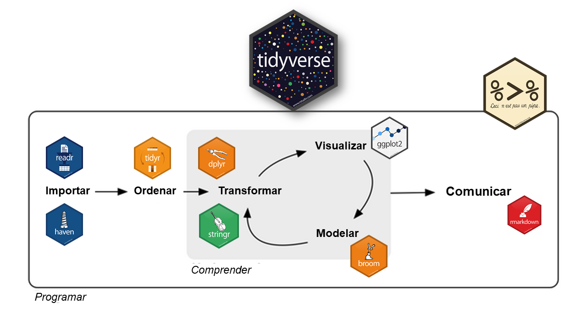

# Bienvenidos y bienvenidas {background-color="#4F7CFF"}

## Contacto con Estación R

<br><br>

::: columns
::: {.column width="33%"}
#### [Slack](https://estacion-r.slack.com/)

#### [Web](https://estacion-r.com)

#### [Correo](mailto:pablotiscornia@estacion-r.com)
:::

::: {.column width="33%"}
#### [Mastodon](https://botsin.space/@r_tips)

#### [X](https://twitter.com/estacion_erre)
:::

::: {.column width="33%"}
#### [LinkedIn](https://www.linkedin.com/company/estacion-r/)

#### [Instagram](https://instagram.com/estacion_ere)
:::
:::

## ¿Qué vimos hasta ahora?

<br>

::: {.fragment .fade-in-then-semi-out}
✅ La **EPH**: qué mide, cómo se estructura, cuestionarios
:::

<br>

::: {.fragment .fade-in-then-semi-out}
✅ Conceptos básicos de **R**: valores, vectores, funciones, objetos
:::

<br>

::: {.fragment .fade-in-then-semi-out}
✅ Cómo usar la **IA como asistente** para aprender R
:::

<br>

::: {.fragment}
✅ **RStudio**: consola, scripts, entorno
:::

## Hoja de Ruta - Hoy {background-color="#F5F5F5"}

<br>

::: columns
::: {.column width="50%"}

::: {.fragment .fade-in-then-semi-out}
📦 `{tidyverse}`: un universo de paquetes
:::

<br>

::: {.fragment .fade-in-then-semi-out}
📥 **Importar datos**: la EPH en R
:::

<br>

::: {.fragment .fade-in-then-semi-out}
🔗 La **pipa** (`|>`)
:::
:::

::: {.column width="50%"}

::: {.fragment .fade-in-then-semi-out}
🔧 `select()` - elegir columnas
:::

<br>

::: {.fragment}
🔧 `filter()` - filtrar filas
:::
:::
:::

# Paquetes en R {background-color="#4F7CFF"}

## ¿Qué son los paquetes?

<br>

::: {.fragment .fade-in-then-semi-out}
R viene con funciones básicas (`c()`, `mean()`, `class()`...), pero su verdadero poder está en los **paquetes**.
:::

<br>

::: {.fragment .fade-in-then-semi-out}
Un **paquete** es un conjunto de funciones que alguien creó para resolver un problema específico.
:::

<br>

::: {.fragment}
Pensalo como una **caja de herramientas**: R es el taller, y los paquetes son cajas con herramientas especializadas que podemos agregar.
:::

## ¿Cómo se usan los paquetes?

<br>

::: {.fragment .fade-in-then-semi-out}
**Paso 1:** Instalar (una sola vez, como descargar una app):

``` r
install.packages("nombre_del_paquete")
```
:::

<br>

::: {.fragment}
**Paso 2:** Cargar (cada vez que abrimos R, como abrir la app):

``` r
library(nombre_del_paquete)
```
:::

<br>

::: {.fragment}
> Primero se **instala** (una vez), después se **carga** (cada sesión).
:::

# `{tidyverse}` {background-color="#4F7CFF"}

## ¿Qué es `{tidyverse}`?

<br>

::: {.fragment .fade-in-then-semi-out}
- Una **colección de paquetes** de R.
:::

::: {.fragment .fade-in-then-semi-out}
- Comparten una filosofía acerca de los datos y la programación en R ("*tidy*" - *ordenado*).
:::

::: {.fragment .fade-in-then-semi-out}
- Tienen una **coherencia** para ser utilizados en conjunto.
:::

::: {.fragment .fade-in-then-semi-out}
- Orientado a ser leído y escrito **por y para seres humanos**.
:::

::: {.fragment}
- Una **comunidad**, basada en los principios del código abierto y trabajo colaborativo.
:::

## ¿Qué es `{tidyverse}`?

<br>

{fig-align="center"}

## `{tidyverse}` - Instalación y carga

<br>

- Instalación (una sola vez):

``` r
install.packages("tidyverse")
```

<br>

::: {.fragment}
- Cargo el paquete (cada vez que abro R):

```{r message=TRUE, warning=TRUE}
library(tidyverse)
```
:::

# Importar datos: la EPH en R {background-color="#4F7CFF"}

## ¿Cómo traemos datos a R?

<br>

::: {.fragment .fade-in-then-semi-out}
Hasta ahora creamos datos "a mano" con `c()` y `data.frame()`.
:::

<br>

::: {.fragment .fade-in-then-semi-out}
Pero en la práctica, los datos **ya existen**: en archivos `.csv`, `.xlsx`, bases de datos...
:::

<br>

::: {.fragment}
Hoy vamos a importar datos **reales** de la EPH.
:::

## Opción 1: Descargar desde INDEC {background-color="#F5F5F5"}

<br>

::: {.fragment .fade-in-then-semi-out}
1. Ir a la [página del INDEC](https://www.indec.gob.ar/indec/web/Institucional-Indec-BasesDeDatos)
:::

<br>

::: {.fragment .fade-in-then-semi-out}
2. Buscar "Encuesta Permanente de Hogares" > **Bases trimestrales**
:::

<br>

::: {.fragment .fade-in-then-semi-out}
3. Descargar el archivo `.zip` del trimestre deseado
:::

<br>

::: {.fragment}
4. Descomprimir y usar `read.csv()` o `read_csv()` para leer el archivo `.txt`
:::

## Opción 1: Importar con `read.csv()`

<br>

``` r
# Opción con R base
eph_ind <- read.csv("datos/usu_individual_T124.txt",
                     sep = ";")
```

<br>

::: {.fragment}
``` r
# Opción con tidyverse (readr) - más rápida
library(readr)

eph_ind <- read_csv2("datos/usu_individual_T124.txt")
```
:::

## Opción 2: El paquete `{eph}` {background-color="#F5F5F5"}

<br>

::: {.fragment .fade-in-then-semi-out}
El paquete `{eph}` fue creado por la comunidad R argentina para facilitar el trabajo con la EPH.
:::

<br>

::: {.fragment .fade-in-then-semi-out}
``` r
# Instalar (una sola vez)
install.packages("eph")
```
:::

<br>

::: {.fragment}
``` r
# Descargar datos directamente desde R
library(eph)

eph_ind <- get_microdata(year = 2024,
                         trimester = 1,
                         type = "individual")
```
:::

## Nuestros datos para hoy

```{r}
#| include: false
#| echo: false
library(readr)
eph_ind <- read_csv(here::here("data/eph_individual.csv"))
```

``` r
library(readr)
eph_ind <- read_csv("datos/eph_individual.csv")
```

<br>

```{r}
# ¿Cuántas filas y columnas?
dim(eph_ind)
```

<br>

::: {.fragment}
> **46.050 personas** y **235 variables**. Cada fila es una persona encuestada.
:::

## Explorando la base

<br>

```{r}
# ¿Qué columnas tiene? (mostramos las primeras 20)
head(colnames(eph_ind), 20)
```

`head()` nos muestra los **primeros elementos** de un resultado (acá, las primeras 20 columnas).

<br>

::: {.fragment}
> Los nombres de las variables son **códigos** (CH04, CH06, ESTADO...). Para entender qué significan, necesitamos el [**diseño de registro**](https://www.indec.gob.ar/ftp/cuadros/menusuperior/eph/EPH_registro_1t19.pdf) de la EPH.
:::

## Variables clave de la EPH {background-color="#F5F5F5"}

<br>

| Variable | Significado | Valores |
|----------|-------------|---------|
| `CH04` | **Sexo** | 1=Varón, 2=Mujer |
| `CH06` | **Edad** | Años cumplidos |
| `ESTADO` | **Condición de actividad** | 1=Ocupado, 2=Desocupado, 3=Inactivo |
| `CAT_OCUP` | **Categoría ocupacional** | 1=Patrón, 2=Cta. propia, 3=Asalariado |
| `NIVEL_ED` | **Nivel educativo** | 1 a 7 (de primaria incompleta a superior completa) |
| `P21` | **Ingreso ocupación principal** | En pesos |
| `REGION` | **Región estadística** | 1=GBA, 40=NOA, 41=NEA, 42=Cuyo, 43=Pampeana, 44=Patagonia |

# La pipa {background-color="#4F7CFF"}

## Un operador llamado `pipa`

<br><br>

::: columns
::: {.column width="50%"}
<br>

```{r eval=FALSE}
base_de_datos |>
  funcion1 |>
  funcion2 |>
  funcion3
```
:::

::: {.column width="50%"}

:::
:::

## Un operador llamado `pipa`

<br>

::: {.fragment .fade-in-then-semi-out}
- Pipa de **R base**: `|>` (atajo: `Ctrl + Shift + M`)
:::

<br>

::: {.fragment}
- Pipa de **{magrittr}**: `%>%`
:::

<br>

::: {.fragment}
> Ambas hacen lo mismo: **pasan el resultado de la izquierda como primer argumento de la función de la derecha**
:::

## Ejemplo sin pipa

<br><br>

```{r}
datos <- data.frame(nombre = c("Pirulanzo", "Rodogovia", "Rodogovia", "Rodogovia"),
                    edad = c(23, 12, 87, 32))

datos
```

## Ejemplo sin pipa

<br>

- Quiero calcular qué proporción de personas se llaman *Rodogovia*

<br>

- Antes (*sin el pipe*):

```{r}
round(prop.table(table(datos$nombre)), digits = 1)
```

<br>

::: {.fragment}
> Se lee de adentro hacia afuera... 🤯
:::

## Ejemplo con pipa

<br>

- Después (*con el pipe*):

```{r}
datos$nombre |>
  table() |>
  prop.table() |>
  round(digits = 1)
```

<br>

::: {.fragment}
> Se lee de arriba hacia abajo, paso a paso ✨
:::

# `select()` {background-color="#4F7CFF"}

##

```{r echo=FALSE, out.width = '30%', fig.align = 'center'}
knitr::include_graphics("images/logo dplyr.png")
```

## Funciones del paquete `{dplyr}`

<br>

| **Función**   |                            **Acción** |
|:--------------|--------------------------------------:|
| **`select()`**    |     *selecciona o descarta columnas* |
| **`filter()`**    |                    *selecciona filas* |
| `mutate()`    |              *crea / edita variables* |
| `rename()`    |                  *renombra variables* |
| `group_by()`  | *segmenta en función de una variable* |
| `summarize()` |         *genera una tabla de resumen* |

::: {.fragment}
> Hoy nos enfocamos en **select()** y **filter()**. El resto, la semana que viene.
:::

## `select()` - Elige o descarta columnas {background-color="#F5F5F5"}

<br>

- La función tiene la siguiente estructura:

```{r}
#| eval: false
base_de_datos |>
  select(variable1, variable2)
```

```{r echo=FALSE, fig.align = 'center', out.width='65%'}
knitr::include_graphics("images/select_presentacion.png")
```

## Caso práctico

<br>

::: {.fragment .fade-in-then-semi-out}
- **Pedido:** La directora de investigación nos pidió analizar la **edad** y el **sexo** de la población encuestada, junto con su **condición de actividad**.
:::

<br>

::: {.fragment}
- Variables de trabajo:

    -   `CH04` (sexo)
    -   `CH06` (edad)
    -   `ESTADO` (condición de actividad)
:::

## Caso práctico - Selecciono columnas

<br>

```{r}
#| code-line-numbers: "2"
eph_ind |>
  select(CH04, CH06, ESTADO)
```

## Caso práctico - Guardo en un objeto

<br>

```{r}
#| code-line-numbers: "1"
eph_sel <- eph_ind |>
  select(CH04, CH06, ESTADO)
```

<br>

::: {.fragment}
```{r}
colnames(eph_sel)
```

> Ahora `eph_sel` tiene solo 3 columnas, en vez de las 235 originales.
:::

## `select()` - por posición {background-color="#F5F5F5"}

<br>

```{r}
# Selecciono las columnas 1, 12 y 14 (CODUSU, CH04, CH06)
eph_ind |>
  select(1, 12, 14) |>
  colnames()
```

<br>

::: {.fragment}
```{r}
# Selecciono un rango de columnas consecutivas
eph_ind |>
  select(11:16) |>
  colnames()
```
:::

## `select()` - Por patrones de texto {background-color="#F5F5F5"}

<br>

**Trío muy útil:**

::: {.fragment .fade-in-then-semi-out}
- `starts_with()` --> *empieza con...*
:::

::: {.fragment .fade-in-then-semi-out}
- `ends_with()` --> *termina con...*
:::

::: {.fragment}
- `contains()` --> *contiene...*
:::

## `select()` + `starts_with()`

<br>

```{r}
# Todas las variables del cuestionario de Hogar (empiezan con "CH")
eph_ind |>
  select(starts_with("CH")) |>
  colnames()
```

## `select()` + `ends_with()`

<br>

```{r}
# Variables que terminan en "_COD" (códigos de clasificación)
eph_ind |>
  select(ends_with("_COD")) |>
  colnames()
```

## `select()` + `contains()`

<br>

```{r}
# Variables que contienen "ING" (relacionadas a ingresos)
eph_ind |>
  select(contains("ING")) |>
  colnames()
```

## La combinación final {background-color="#F5F5F5"}

<br>

Se pueden combinar todas las formas:

```{r}
#| code-line-numbers: "2"
eph_ind |>
  select(CODUSU, CH04, CH06, starts_with("P21"), ESTADO, REGION) |>
  colnames()
```

# Ejercitación {background-color="#D4FF4F"}

## Ejercitación `select()`

<br>

Usando la base de la EPH:

::: {.fragment .fade-in-then-semi-out}
1. Seleccionar las variables `CH04` (sexo), `CH06` (edad) y `P21` (ingreso) y guardar en un objeto.
:::

<br>

::: {.fragment .fade-in-then-semi-out}
2. Seleccionar **todas las variables que empiecen con "CH"** y guardar en otro objeto. ¿Cuántas hay?
:::

<br>

::: {.fragment}
3. Seleccionar las columnas 1 a 5 y verificar con `colnames()`.
:::

# `filter()` {background-color="#4F7CFF"}

## `filter()` - Define filas en base a una condición

<br>

- La función tiene la siguiente estructura:

```{r}
#| eval: false
#| code-line-numbers: "2"
base_de_datos |>
  filter(condicion)
```

```{r echo=FALSE, fig.align = 'center', out.width='65%'}
knitr::include_graphics("images/filter_presentacion.png")
```

## Caso práctico

<br>

::: {.fragment .fade-in-then-semi-out}
- Para un informe de empleo, necesitamos quedarnos solo con la **población ocupada** (`ESTADO == 1`).
:::

<br>

::: {.fragment}
- Primero, chequeamos los valores de la variable:

```{r}
unique(eph_ind$ESTADO)
```

> Recordar: 1=Ocupado, 2=Desocupado, 3=Inactivo, 4=Menor de 10 años
:::

## Caso práctico - Aplico filtro

<br>

```{r}
eph_ocupados <- eph_ind |>
  filter(ESTADO == 1)
```

<br>

::: {.fragment}
- Chequeo que funcionó:

```{r}
unique(eph_ocupados$ESTADO)
```

```{r}
# ¿Cuántas personas ocupadas hay?
nrow(eph_ocupados)
```
:::

## Operadores de comparación {background-color="#F5F5F5"}

<br>

::: columns
::: {.column width="50%"}
| Condición | Acción              |
|:----------|:--------------------|
| `==`      | *igual*             |
| `%in%`    | *incluye*           |
| `!=`      | *distinto*          |
| `>`       | *mayor que*         |
| `<`       | *menor que*         |
| `>=`      | *mayor o igual que* |
| `<=`      | *menor o igual que* |
:::

::: {.column width="50%"}
| Operador | Descripción                                 |
|:---------|:--------------------------------------------|
| `&`      | *y* - Ambas condiciones se cumplen   |
| `\|`     | *o* - Una u otra condición se cumple |
:::
:::

## Caso práctico - Filtro numérico

<br>

- Queremos analizar a la **población mayor de 65 años**:

```{r}
eph_mayores <- eph_ind |>
  filter(CH06 > 65)

nrow(eph_mayores)
```

## Caso práctico - Múltiples condiciones

<br>

- Para un estudio de género y empleo: **mujeres ocupadas**.

<br>

::: {.fragment .fade-in-then-semi-out}
- Opción 1 (con `&`):

```{r}
eph_mujeres_ocup <- eph_ind |>
  filter(CH04 == 2 & ESTADO == 1)

nrow(eph_mujeres_ocup)
```
:::

## Caso práctico - Operador `%in%`

<br>

- Queremos analizar solo **GBA y Patagonia** (`REGION` 1 y 44):

```{r}
eph_gba_pat <- eph_ind |>
  filter(REGION %in% c(1, 44))

table(eph_gba_pat$REGION)
```

<br>

::: {.fragment}
> `%in%` es más prolijo que escribir `REGION == 1 | REGION == 44`, especialmente cuando son varias categorías.
:::

## Novedad: `filter_out()` {background-color="#F5F5F5"}

<br>

::: {.fragment .fade-in-then-semi-out}
Desde febrero 2026, dplyr incluye `filter_out()`: el complemento de `filter()`.
:::

<br>

::: {.fragment .fade-in-then-semi-out}
- `filter()` = **me quedo con** las filas que cumplen la condición
- `filter_out()` = **saco** las filas que cumplen la condición
:::

<br>

::: {.fragment}
```{r}
#| eval: false
# Estas dos líneas hacen lo mismo:
eph_ind |> filter(ESTADO != 4)

eph_ind |> filter_out(ESTADO == 4)
```
:::

<br>

::: {.fragment}
> Para usarlo, actualizar dplyr: `install.packages("dplyr")`
:::

# Combinando `select()` + `filter()` {background-color="#4F7CFF"}

## `select()` + `filter()`

<br>

::: columns
::: {.column width="60%"}
```{r}
#| eval: false
#| code-line-numbers: "2,3"
eph_ind |>
  select(CH04, CH06,
         ESTADO, P21)
```
:::

::: {.column width="40%"}
```{r}
#| echo: false
eph_ind |>
  select(CH04, CH06, ESTADO, P21)
```
:::
:::

## `select()` + `filter()`

<br>

::: columns
::: {.column width="60%"}
```{r}
#| eval: false
#| code-line-numbers: "4"
eph_ind |>
  select(CH04, CH06,
         ESTADO, P21) |>
  filter(ESTADO == 1)
```
:::

::: {.column width="40%"}
```{r}
#| echo: false
eph_ind |>
  select(CH04, CH06, ESTADO, P21) |>
  filter(ESTADO == 1)
```
:::
:::

::: {.fragment}
> La **pipa** nos permite encadenar operaciones paso a paso 🔗
:::

## Un análisis más completo

<br>

```{r}
# Mujeres ocupadas de GBA, con sus ingresos
eph_ind |>
  select(CH04, CH06, ESTADO, REGION, P21) |>
  filter(ESTADO == 1,
         CH04 == 2,
         REGION == 1,
         P21 > 0)
```

# Ejercitación {background-color="#D4FF4F"}

## Ejercitación `select()` + `filter()`

<br>

::: {.fragment .fade-in-then-semi-out}
1. Crear un objeto con las variables `CH04`, `CH06`, `NIVEL_ED` y `ESTADO`. Filtrar solo la **población inactiva** (`ESTADO == 3`).
:::

<br>

::: {.fragment .fade-in-then-semi-out}
2. Del objeto anterior, ¿cuántas personas inactivas hay? (*tip: `nrow()`*)
:::

<br>

::: {.fragment .fade-in-then-semi-out}
3. Crear un objeto con **varones mayores de 18 años** (`CH04 == 1` y `CH06 > 18`), seleccionando las variables `CH06`, `ESTADO` y `P21`.
:::

<br>

::: {.fragment}
4. **Desafío:** Filtrar la población **ocupada de la región Pampeana** (`REGION == 43`) que tenga un ingreso (`P21`) **mayor a 0**. ¿Cuántas personas son?
:::

# Para la semana que viene... {background-color="#F5F5F5"}

## Próximo encuentro: tidyverse II (18/02)

<br>

::: {.fragment .fade-in-then-semi-out}
🔧 `mutate()` + `case_when()` - crear y recodificar variables
:::

<br>

::: {.fragment .fade-in-then-semi-out}
🔧 `summarise()` - resumir información
:::

<br>

::: {.fragment .fade-in-then-semi-out}
🔧 `group_by()` - operar por grupos
:::

<br>

::: {.fragment}
🎯 Combinando todo: **tidyverse en acción** con la EPH
:::

## ¡Gracias! {background-color="#4F7CFF"}

<br><br>

### Nos vemos el **martes 18 de febrero**

<br>

📧 [pablotiscornia@estacion-r.com](mailto:pablotiscornia@estacion-r.com)

💬 [Slack de Estación R](https://estacion-r.slack.com/)
