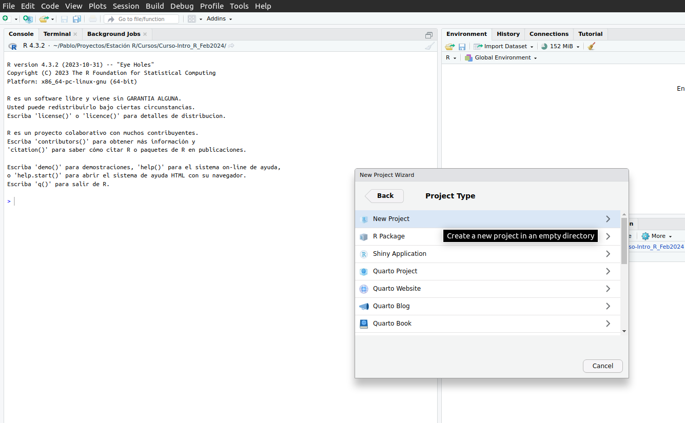

# Bienvenidos y bienvenidas {background-color="#4F7CFF"}

## Contacto con Estación R

<br><br>

:::::: columns
::: {.column width="33%"}
#### [Slack](https://estacion-r.slack.com/)

#### [Web](https://estacion-r.com)

#### [Correo](mailto:pablotiscornia@estacion-r.com)
:::

::: {.column width="33%"}
#### [Mastodon](https://botsin.space/@r_tips)

#### [X](https://twitter.com/estacion_erre)
:::

::: {.column width="33%"}
#### [LinkedIn](https://www.linkedin.com/company/estacion-r/)

#### [Instagram](https://instagram.com/estacion_ere)
:::
::::::

## ¿Qué vimos hasta ahora?

<br>

::: {.fragment .fade-in-then-semi-out}
✅ La **EPH**: qué mide, cómo se estructura
:::

<br>

::: {.fragment .fade-in-then-semi-out}
✅ Conceptos básicos de **R**: valores, vectores, funciones, objetos
:::

<br>

::: {.fragment .fade-in-then-semi-out}
✅ **Tidyverse**: paquetes, importación, `select()`, `filter()`
:::

<br>

::: fragment
✅ `mutate()`, `case_when()`, `summarise()`, `group_by()`
:::

## Hoja de Ruta - Hoy {background-color="#F5F5F5"}

<br>

::::::::: columns
::::: {.column width="50%"}
::: {.fragment .fade-in-then-semi-out}
📁 **Proyectos de R** - Organizar la mesa de trabajo
:::

<br>

::: {.fragment .fade-in-then-semi-out}
📊 **ggplot2** - Visualización de datos
:::
:::::

::::: {.column width="50%"}
::: {.fragment .fade-in-then-semi-out}
🎯 **TP integrador** - Consigna del trabajo final
:::

<br>

::: fragment
🏁 ¡Último encuentro del curso!
:::
:::::
:::::::::

# Proyectos de R {background-color="#4F7CFF"}

{width="200" height="160" style="display: block; margin: 0 auto"}

## El problema

<br>

::: {.fragment .fade-in-then-semi-out}
-   Hasta ahora importamos datos indicando la **ruta completa** del archivo:
:::

<br>

::: fragment
``` r
base_personas <- read_csv("/home/pablote/Documentos/datos/nombres-2015.csv")
```
:::

## El problema

<br>

-   Si compartimos el script a otra persona, **el código se rompe**

<br>

::: {.fragment .fade-in-then-semi-out}
-   Si cambiamos de computadora, **el código se rompe**
:::

<br>

::: fragment
-   Si cambiamos la base de lugar, **el código se rompe**
:::

## La solución: Proyectos de RStudio {background-color="#F5F5F5"}

<br>

::: {.fragment .fade-in-then-semi-out}
Un **proyecto de RStudio** define una carpeta como **directorio de trabajo**.
:::

<br>

::: {.fragment .fade-in-then-semi-out}
Esto significa que las rutas de archivos se vuelven **relativas** a esa carpeta.
:::

<br>

::: fragment
> Ya no necesitamos rutas completas. Solo indicamos la ruta **dentro del proyecto**.
:::

## Crear un proyecto - Paso a paso

<br>

**File → New Project → New Directory → New Project**

<br>

::::: columns
::: {.column width="50%"}

:::

::: {.column width="50%"}

:::
:::::

## Crear un proyecto - Resultado

<br>

{fig-align="center" width="70%"}

## Antes vs. Después {background-color="#F5F5F5"}

<br>

::: {.fragment .fade-in-then-semi-out}
**Antes** *(sin proyecto - ruta absoluta)*

``` r
base_personas <- read_csv("/home/pablote/Documentos/datos/nombres-2015.csv")
```
:::

<br>

::: fragment
**Después** *(con proyecto - ruta relativa)*

``` r
base_personas <- read_csv("datos/nombres-2015.csv")
```
:::

<br>

::: fragment
> Más corto, más portable, más reproducible.
:::

## Estructura de carpetas recomendada

<br>

-   📂 **mi_proyecto/**
    -    *mi_proyecto.Rproj*
    -   📂 **datos/**
        -   ⛁ *eph_individual.csv*
    -   📂 **scripts/**
        -   📄 *01_procesamiento.R*
    -   📂 **outputs/**
        -   📊 *grafico_ingresos.png*
    -   📂 **docs/**
        -   📚 *informe.Rmd*

## Manos a la obra {background-color="#D4FF4F"}

<br>

::: {.fragment .fade-in-then-semi-out}
1.  **Crear un proyecto nuevo** en RStudio (o abrir el que veníamos usando)
:::

<br>

::: {.fragment .fade-in-then-semi-out}
2.  Crear una carpeta `datos` y guardar ahí la base de la **EPH**
:::

<br>

::: {.fragment .fade-in-then-semi-out}
3.  Crear un **script** nuevo y cargar los datos:
:::

::: fragment
``` r
library(tidyverse)
eph_ind <- read_csv("datos/eph_individual.csv")
```
:::

# Visualización de datos {background-color="#4F7CFF"}

## ¿Por qué visualizar?

<br>

::: {.fragment .fade-in-then-semi-out}
*"La visualización es el proceso de hacer visibles los contrastes, ritmos y eventos que los datos expresan, que no podemos percibir cuando vienen en forma de áridas listas de números."*
:::

<br>

::: {.fragment .fade-in-then-semi-out}
-   Interpretar y decodificar la información de forma visual
:::

<br>

::: fragment
-   Guiar hacia el hallazgo
:::

# `{ggplot2}` {background-color="#4F7CFF"}

{fig-align="center" width="200"}

## ¿Qué es `{ggplot2}`?

<br>

::: {.fragment .fade-in-then-semi-out}
-   Una implementación del sistema **Grammar of Graphics** (Wilkinson, 2005).
:::

<br>

::: {.fragment .fade-in-then-semi-out}
-   Un esquema pensado en **capas** (datos → plano → geometrías)
:::

<br>

::: fragment
-   Un paquete de funciones de aplicación **intuitiva**.
:::

## ¿Por qué `{ggplot2}`? {background-color="#F5F5F5"}

<br>

::: {.fragment .fade-in-then-semi-out}
-   Tiene un marco de referencia (Grammar of Graphics)
:::

::: {.fragment .fade-in-then-semi-out}
-   Flexible, con especificaciones a nivel de capas
:::

::: {.fragment .fade-in-then-semi-out}
-   Sistema de `themes` para pulir la apariencia
:::

::: {.fragment .fade-in-then-semi-out}
-   Decenas de extensiones para ampliar su potencia
:::

::: fragment
-   Comunidad activa y predispuesta a ayudar
:::

## ¿A dónde vamos?

```{r}
#| include: false
library(tidyverse)
eph_ind <- read_csv(here::here("data/eph_individual.csv"))
```

::: panel-tabset
### Gráfico

```{r}
#| label: example-motivation
#| fig-width: 7
#| fig-height: 4
#| fig-align: "center"
#| echo: false

eph_ind |>
  filter(ESTADO %in% c(1, 2, 3)) |>
  mutate(actividad = case_when(
    ESTADO == 1 ~ "Ocupado",
    ESTADO == 2 ~ "Desocupado",
    ESTADO == 3 ~ "Inactivo"
  )) |>
  summarise(cantidad = n(), .by = actividad) |>
  ggplot(aes(x = actividad, y = cantidad)) +
  geom_col(aes(fill = actividad)) +
  geom_text(aes(label = scales::number(cantidad, big.mark = ".")),
            vjust = -0.5, size = 4) +
  geom_hline(yintercept = 0) +
  labs(title = "Población por condición de actividad",
       subtitle = "EPH - T1 2024",
       x = "",
       y = "Cantidad de personas",
       caption = "Fuente: Elaboración propia en base a EPH-INDEC",
       fill = "Condición") +
  theme_minimal() +
  theme(legend.position = "none")
```

### Código

```{r}
#| label: example-motivation
#| eval: false
```
:::

## Gráfico en clave de capas

<br>

3 capas son indispensables:

<br>

::: {.fragment .fade-in-then-semi-out}
1.  Los **datos** (`data =`): el dataframe de insumo
:::

<br>

::: {.fragment .fade-in-then-semi-out}
2.  Las **aesthetics** (`aes()`): vínculo entre datos y propiedades visuales (ejes x, y)
:::

<br>

::: fragment
3.  Las **geometrías** (`geom_*()`): la forma con que se representan los datos
:::

## Preparamos los datos {background-color="#F5F5F5"}

<br>

-   **Pregunta:** ¿Cuántas personas hay por condición de actividad?

<br>

::: fragment
```{r}
df_actividad <- eph_ind |>
  filter(ESTADO %in% c(1, 2, 3)) |>
  mutate(actividad = case_when(
    ESTADO == 1 ~ "Ocupado",
    ESTADO == 2 ~ "Desocupado",
    ESTADO == 3 ~ "Inactivo"
  )) |>
  summarise(cantidad = n(), .by = actividad)
```
:::

::: fragment
> Usamos todo lo aprendido en las clases anteriores: `filter()`, `mutate()`, `case_when()`, `summarise()`.
:::

## Capa 1 y 2: datos + aesthetics

```{r}
#| output-location: column
#| code-line-numbers: "1|2"
ggplot(data = df_actividad,
       aes(x = actividad, y = cantidad))
```

## Capa 3: geometría

```{r}
#| output-location: column
#| code-line-numbers: "3"
ggplot(data = df_actividad,
       aes(x = actividad, y = cantidad)) +
  geom_col()
```

# Chapa y pintura {background-color="#4F7CFF"}

## Relleno con un color fijo

```{r}
#| output-location: column
#| code-line-numbers: "3"
ggplot(data = df_actividad,
       aes(x = actividad, y = cantidad)) +
  geom_col(fill = "steelblue")
```

## Relleno según una variable

```{r}
#| output-location: column
#| code-line-numbers: "3"
ggplot(data = df_actividad,
       aes(x = actividad, y = cantidad)) +
  geom_col(aes(fill = actividad))
```

## Contorno

```{r}
#| output-location: column
#| code-line-numbers: "4"
ggplot(data = df_actividad,
       aes(x = actividad, y = cantidad)) +
  geom_col(aes(fill = actividad),
           color = "black")
```

## Referencias con `labs()` {background-color="#F5F5F5"}

```{r}
#| output-location: column
#| code-line-numbers: "5,6,7,8,9"
ggplot(data = df_actividad,
       aes(x = actividad, y = cantidad)) +
  geom_col(aes(fill = actividad),
           color = "black") +
  labs(title = "Población por condición de actividad",
       subtitle = "EPH - T1 2024",
       x = "",
       y = "Cantidad de personas",
       caption = "Fuente: EPH-INDEC")
```

## Temas (`theme`)

```{r}
#| output-location: column
#| code-line-numbers: "10,11"
ggplot(data = df_actividad,
       aes(x = actividad, y = cantidad)) +
  geom_col(aes(fill = actividad),
           color = "black") +
  labs(title = "Población por condición de actividad",
       subtitle = "EPH - T1 2024",
       x = "",
       y = "Cantidad de personas",
       caption = "Fuente: EPH-INDEC") +
  theme_minimal() +
  theme(legend.position = "none")
```

# Ejercitación {background-color="#D4FF4F"}

## Ejercitación: visualización con `{ggplot2}`

<br>

::: {.fragment .fade-in-then-semi-out}
1.  Calcular el **ingreso promedio** (`P21`) de la población **ocupada** (`ESTADO == 1`) con ingreso positivo (`P21 > 0`), **por sexo** (`CH04`). Recordar recodificar sexo con `case_when()`.
:::

<br>

::: {.fragment .fade-in-then-semi-out}
2.  Con esa tabla, crear un gráfico de barras (`geom_col()`) con el **ingreso promedio en el eje y** y el **sexo en el eje x**.
:::

<br>

::: {.fragment .fade-in-then-semi-out}
3.  Agregarle **relleno** por sexo, **título** y `theme_minimal()`.
:::

<br>

::: fragment
4.  **Desafío:** Hacer lo mismo pero agrupando por **sexo y región** (`REGION`). *Tip: usar `fill = factor(REGION)` dentro de `aes()`*.
:::

## Resolución - Ejercicio 1 a 3 {background-color="#F5F5F5"}

::: panel-tabset
### Código

```{r}
#| eval: false
df_ingreso_sexo <- eph_ind |>
  filter(ESTADO == 1, P21 > 0) |>
  mutate(sexo = case_when(CH04 == 1 ~ "Varón",
                          CH04 == 2 ~ "Mujer")) |>
  summarise(ingreso_promedio = mean(P21), .by = sexo)

ggplot(data = df_ingreso_sexo,
       aes(x = sexo, y = ingreso_promedio)) +
  geom_col(aes(fill = sexo), color = "black") +
  labs(title = "Ingreso promedio por sexo",
       subtitle = "Población ocupada - EPH T1 2024",
       x = "", y = "Ingreso promedio ($)",
       caption = "Fuente: EPH-INDEC") +
  theme_minimal() +
  theme(legend.position = "none")
```

### Resultado

```{r}
#| echo: false
#| fig-width: 7
#| fig-height: 4
#| fig-align: "center"
df_ingreso_sexo <- eph_ind |>
  filter(ESTADO == 1, P21 > 0) |>
  mutate(sexo = case_when(CH04 == 1 ~ "Varón",
                          CH04 == 2 ~ "Mujer")) |>
  summarise(ingreso_promedio = mean(P21), .by = sexo)

ggplot(data = df_ingreso_sexo,
       aes(x = sexo, y = ingreso_promedio)) +
  geom_col(aes(fill = sexo), color = "black") +
  labs(title = "Ingreso promedio por sexo",
       subtitle = "Población ocupada - EPH T1 2024",
       x = "", y = "Ingreso promedio ($)",
       caption = "Fuente: EPH-INDEC") +
  theme_minimal() +
  theme(legend.position = "none")
```
:::

# Trabajo Práctico Integrador {background-color="#4F7CFF"}

## Consigna del TP

<br>

::: {.fragment .fade-in-then-semi-out}
**Tema:** Ejercicio de análisis con tema libre. Pueden usar la EPH u otra base de datos propia.
:::

<br>

::: {.fragment .fade-in-then-semi-out}
**Eje:** Plantear una pregunta sencilla sobre el tema elegido y responderla con datos.
:::

<br>

::: fragment
**Contenido esperado:**

-   **Importación** de datos
-   **Procesamiento** con tidyverse (`filter`, `select`, `mutate`, `summarise`)
-   **Visualización** con `ggplot2` (al menos 1-2 gráficos)
-   Breve **análisis** de los hallazgos
:::

## Formato de entrega {background-color="#F5F5F5"}

<br>

::: {.fragment .fade-in-then-semi-out}
📂 Enviar un **proyecto de RStudio** completo (carpeta con subcarpetas y archivos)
:::

<br>

::: {.fragment .fade-in-then-semi-out}
📄 Que contenga un informe elaborado con **Rmarkdown** (.Rmd)
:::

<br>

::: {.fragment .fade-in-then-semi-out}
☁️ Subir a **Google Drive** (u otro servicio) y compartir el link
:::

<br>

::: fragment
📧 Enviar a: **federicobaraghian\@gmail.com**

📅 **Fecha de entrega:** Martes 8 de abril de 2026
:::

## Tips para el TP

<br>

::: {.fragment .fade-in-then-semi-out}
-   No elegir una base muy compleja. La EPH está perfecta.
:::

<br>

::: {.fragment .fade-in-then-semi-out}
-   Que el Rmarkdown **corra sin errores** de principio a fin.
:::

<br>

::: {.fragment .fade-in-then-semi-out}
-   El **Slack** queda abierto para consultas.
:::

<br>

::: fragment
-   Se evalúa el **flujo de trabajo**, no la complejidad del análisis.
:::

## Lo que logramos en el curso {background-color="#F5F5F5"}

<br>

::: {.fragment .fade-in-then-semi-out}
✅ Conocer la **EPH** y sus datos
:::

<br>

::: {.fragment .fade-in-then-semi-out}
✅ Bases de **R**: objetos, funciones, vectores
:::

<br>

::: {.fragment .fade-in-then-semi-out}
✅ **Tidyverse** completo: importar, filtrar, seleccionar, transformar, resumir
:::

<br>

::: {.fragment .fade-in-then-semi-out}
✅ **Proyectos** de RStudio para organizar el trabajo
:::

<br>

::: fragment
✅ **Visualización** de datos con ggplot2
:::

## ¡Gracias! {background-color="#4F7CFF"}

<br><br>

### Fue un gusto acompañarlos en este recorrido

<br>

📧 [pablotiscornia\@estacion-r.com](mailto:pablotiscornia@estacion-r.com)

💬 [Slack de Estación R](https://estacion-r.slack.com/)

<br>

::: fragment
> Recuerden: el Slack queda abierto para consultas sobre el TP. Fecha de entrega: **8 de abril de 2026**.
:::